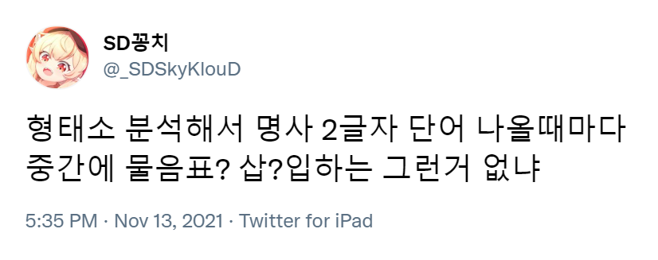

<figure>
  

  <figcaption>
<s>" 내가 몰?루가 될께... "</s>
</figcaption>
</figure>

몰?루파이어
===========
소개
----
 몰?루파이어 *(Mollufier, **몰↗?루↘파이어**처럼 발음합니다)*는 사용자가 입력한 문장에서 형태소 분석기([Kiwi](https://github.com/bab2min/Kiwi))가 인식한 명사 사이에 물음표를 삽입해주는, 재미로 만든 토이 프로젝트이자 서비스입니다.

사용해보기
----------
 몰?루파이어는 현재 제 개인 서버에서 배포하고 있습니다. [**여기를 클릭해 사용해보세요!**](https://app.somni.one/mollufier)

아이디어
--------
<figure>
  

  <figcaption>
<s>그런거 없으면 만들면 된다!</s>
</figcaption>
</figure>

직접 빌드하기
-------------
*작성 중입니다.*

라이선스
--------
 몰?루파이어는 [MIT 라이선스](LICENSE.md) 하에 오픈 소스로 공개하고 있습니다.

만든이 및 주의사항
------
 **솜니 (somni)** / [트위터](https://twitter.com/somni_somni), [GitHub](https://github.com/somnisomni)

  > ※ 본 서비스의 개발자 **솜니 (somni)** 는 사용자가 이 서비스를 이용함으로 인해 발생하는 모든 불이익과 분쟁에 대해 책임을 질 의무를 일절 갖지 않습니다.
  >
  > ※ 사용자가 본 서비스에 입력한 문장 등은 서버에 따로 <u>명시적으로 저장하고 있진 않습니다.</u> 단, 경찰 등 공공기관으로부터 수사 협조 요청이 발생할 경우 본 서비스 관련 로그 파일의 내용이 제공될 수 있습니다.
